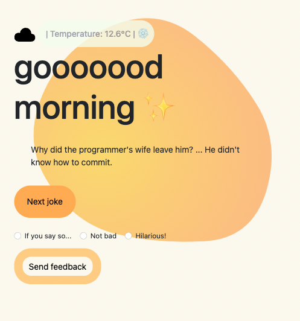

# 📄  Home page for employees to start their shift with jokes! ✨
- Building the logics to call APIs of jokes, showing the results, accessing the current weather through API as well, responsive web design!



## 💻 Stack:
- HTML
- CSS
- Typescript
- Compiled JS

## 📋 Requirements
- Average browsers (chrome, firefox, safari...)
- Github

## 📦 Dependencies

Before running the project, ensure you have the following installed:

- [Node.js](https://nodejs.org/) (Latest LTS recommended)
- [npm](https://www.npmjs.com/) (comes with Node.js)
- Typescript compiler (npx tsc to compile all the changes)

### 📥 Install dependencies

1. **Clone the repo**  
   `git clone https://github.com/OhMyLaia/Api-jokes-morning-remote.git
   cd Api-jokes-morning-remote`
2. 	To run tests with Jest:
 	` npm test`
3. 	Ensure package.json includes the necessary scripts and dependencies:
   ` scripts": {
    "start": "ts-node src/api/api-calls.ts"
  }`
also in tsconfig.json
`         "paths": {
            "src/*": [
                "./src/*"
            ]
        },`
   	

## 🤝 Contributions:
- Fork the repository and clone it locally
- Create a new branch for your feature: ``` git checkout -b feature/my-feature ```
- Stage your changes: ``` git add . ``` // ``` git add * ```
- Commit your changes: ``` git commit -m "Describe your changes" ```
- Push the branch: ``` git push origin feature/my-feature ```
- Open a Pull Request and wait for review 🫡

